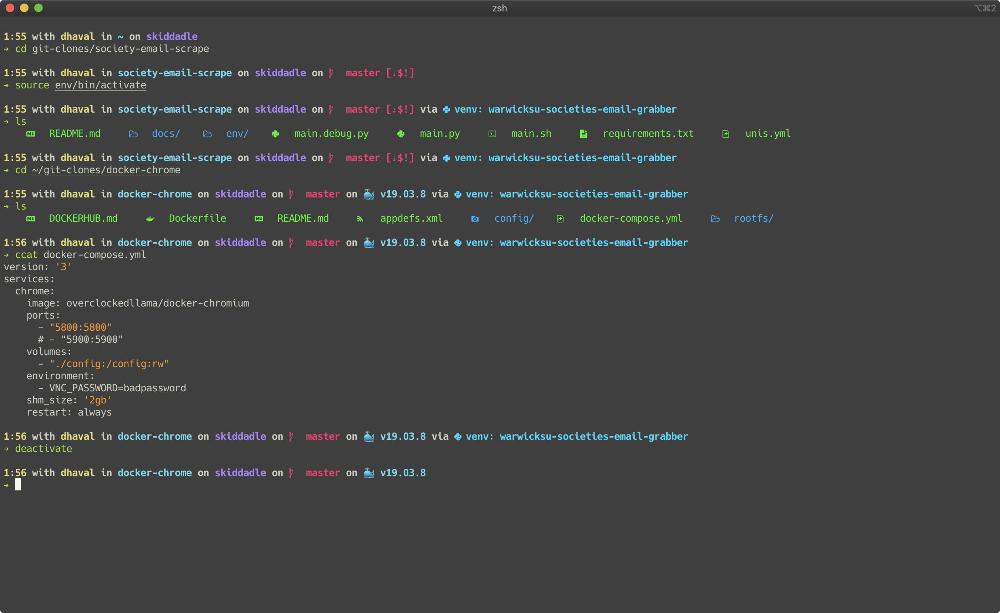
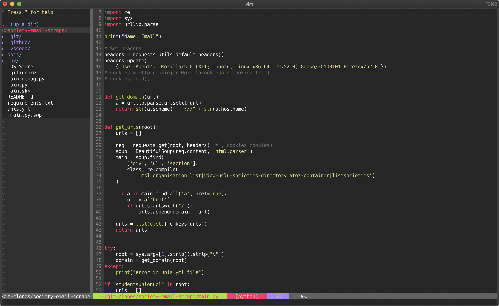

# dotfiles


Welcome to my dotfiles repository. Here I store all my configs

## How to install

```yaml
Universal: 
 sudo curl -fLo /bin/yadm https://github.com/TheLocehiliosan/yadm/raw/master/yadm && 
 sudo chmod a+x /bin/yadm &&
 yadm clone https://github.com/doctorfree/dotfiles-ubuntu.git

Mac: 
 brew install yadm &&
 yadm clone https://github.com/doctorfree/dotfiles-ubuntu.git

Arch (fresh install):
 pacman -Syu sudo git --noconfirm &&
 sudo curl -fLo /bin/yadm https://github.com/TheLocehiliosan/yadm/raw/master/yadm && 
 sudo chmod a+x /bin/yadm &&
 yadm clone https://github.com/doctorfree/dotfiles-ubuntu.git

Arch (AUR with yay): 
 yay -Syu yadm-git &&
 yadm clone https://github.com/doctorfree/dotfiles-ubuntu.git

Debian UNSTABLE/Ubuntu 20.04+: 
 sudo apt install yadm &&
 yadm clone https://github.com/doctorfree/dotfiles-ubuntu.git
```

## Updates
This repository is regurlarly being updated. To update to the latest version of my dotfiles, run:
```bash
yadm pull
```

## Errors
### When cloning
If you encounter any error when cloning, run 
```bash
yadm stash
```
Then reclone with 
```
yadm clone -f https://github.com/doctorfree/dotfiles-ubuntu.git
```
### Running bootstrap script
If you encounter any errors when running the bootstrap script, you can always rerun it with 
```bash
./.config/yadm/bootstrap
```
## Screenshots


